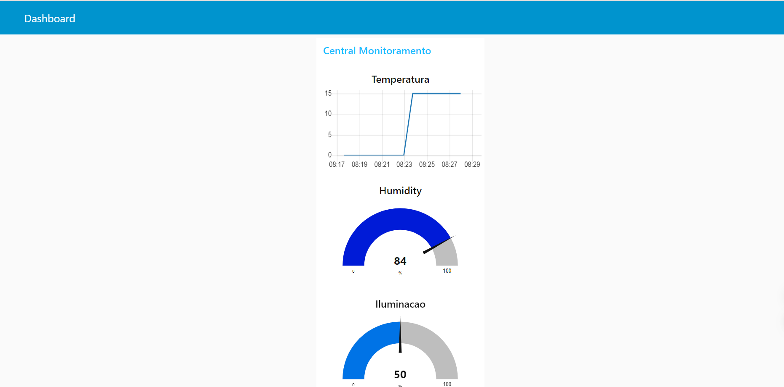

### Central Monitoramento: Leitura de Temperatura, Umidade e Luminosidade com ESP32 e Publicação via MQTT

Este projeto demonstra como ler a temperatura e umidade do sensor DHT11, além da leitura de um sensor LDR, e publicar esses dados usando o protocolo MQTT. A interface de exibição foi criada utilizando Node-RED.

---

### Introdução

Este projeto foi desenvolvido com base no aprendizado do curso "Programe o ESP32 com ESP-IDF 5" de Fábio Souza, disponível em [cursos.embarcados.com.br](https://cursos.embarcados.com.br).

---

### Componentes Utilizados

- **ESP32**
- **Sensor DHT11**
- **Sensor LDR**
- **WiFi**
- **MQTT**

Repositorios dos componentes externos:
- [dht11](https://github.com/UncleRus/esp-idf-lib)

## Como Instalar o Node-RED

1. **Instalar Node.js**
   - Acesse [Node.js](https://nodejs.org/) e baixe a versão LTS.
   - Siga as instruções de instalação para o seu sistema operacional.

2. **Instalar Node-RED**
   - Abra o terminal ou prompt de comando.
   - Execute o comando: 
     ```bash
     npm install -g --unsafe-perm node-red
     ```
   - Após a instalação, verifique a instalação executando:
     ```bash
     node-red
     ```

### Configuração do Projeto

1. **Clonar Repositório**

2. **Configurar as Dependências**
   - Certifique-se de ter o ESP-IDF instalado e configurado.

3. **Configurar o Código**
   - Inclua as bibliotecas no arquivo principal:
     ```c
     #include "dht.h"
     #include "ldr.h"
     #include "wifi.h"
     #include "mqtt_app.h"
     ```

4. **Compilar e Fazer Upload do Código**
   ```sh
   idf.py build
   idf.py flash
   ```

---

### Como Usar

1. **Inicializar NVS e WiFi**
   - O código inicializa o armazenamento NVS e configura o WiFi no modo estação.
   
2. **Inicializar e Ler Sensores**
   
3. **Publicar Dados via MQTT**
   - Os dados são publicados nos tópicos:
     - `esp32-central/temperatura`
     - `esp32-central/umidade`
     - `esp32-central/ldr`
     
4. **Visualizar Dados no Node-RED**


## Como Usar

### Inicializar NVS e WiFi

O código inicializa o armazenamento NVS e configura o WiFi no modo estação.

### Inicializar e Ler Sensores

### Publicar Dados via MQTT

Os dados são publicados nos tópicos:
- `esp32-central/temperatura`
- `esp32-central/umidade`
- `esp32-central/ldr`

### Visualizar Dados no Node-RED

1. **Importar o Flow**
   - Utilize o `flow.json` fornecido no diretório do projeto.
   - No Node-RED, clique no menu no canto superior direito, vá em `Import -> Clipboard`.
   - Cole o conteúdo do `flow.json` e clique em `Import`.

2. **Acessar o Painel**
   - Após a implementação do flow, acesse o painel em: 
     ```
     http://<seu-ip>:1880/ui
     ```
   - Substitua `<seu-ip>` pelo endereço IP do seu servidor onde o Node-RED está rodando.
---

### Exibição no Node-RED

O painel de exibição foi criado usando Node-RED. A imagem abaixo mostra como os dados são exibidos:



---

### Licença

Este código está licenciado sob a MIT License.
---


